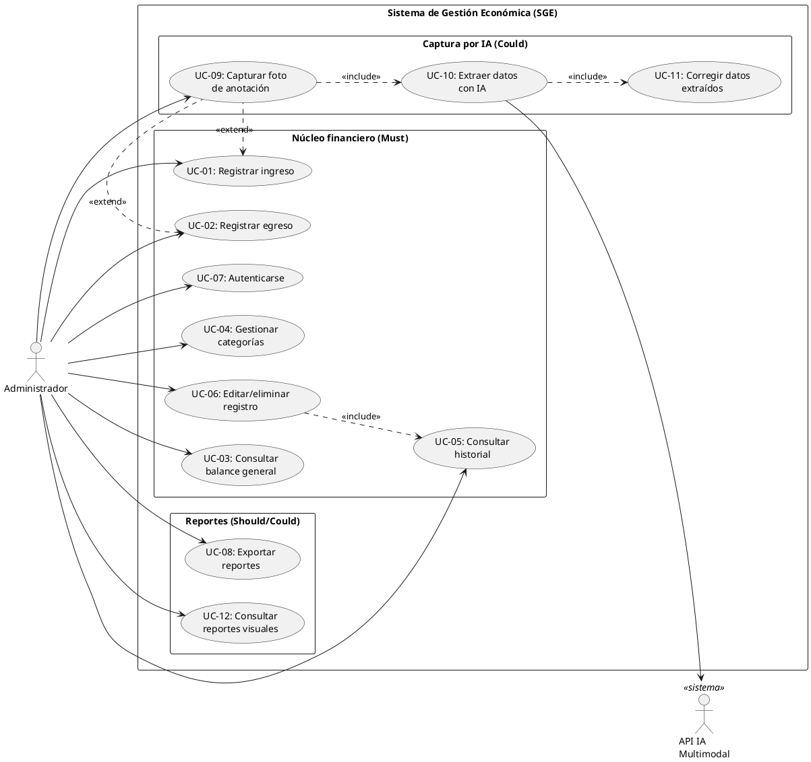

# Casos de Uso
### Sistema de Gestión Económica — Finca Ganadera
*Versión 1 · 9 de julio de 2026*

---

## Diagrama de Casos de Uso

### Relaciones clave

| Relación | Tipo | Justificación |
|---|---|---|
| UC-06 → UC-05 | `<<include>>` | Para editar o eliminar, el administrador primero consulta el historial para localizar el registro |
| UC-09 → UC-10 → UC-11 | `<<include>>` | Cadena obligatoria: capturar foto siempre desencadena extracción, y la extracción siempre pasa por corrección humana |
| UC-09 → UC-01 / UC-02 | `<<extend>>` | La captura por foto es una vía alternativa (opcional) de registrar una transacción |
| UC-10 → API IA | asociación | UC-10 requiere un actor externo (API multimodal) para procesar la imagen |

---

## Especificaciones de Casos de Uso

### UC-01 — Registrar ingreso

| Campo | Detalle |
|---|---|
| **ID** | UC-01 |
| **HU origen** | HU-01 (RF-01 · Must) |
| **Actor principal** | Administrador |
| **Precondición** | El administrador está autenticado (UC-07) |
| **Postcondición** | El ingreso queda persistido localmente y el balance se actualiza |

**Flujo principal:**
1. El administrador selecciona "Registrar ingreso" desde la pantalla principal.
2. El sistema muestra el formulario con: fecha (predeterminada: hoy), categoría de ingreso (lista de categorías activas), monto, nota (opcional), medio de pago (opcional).
3. El administrador completa al menos fecha, categoría y monto.
4. El administrador confirma el registro.
5. El sistema valida los campos obligatorios.
6. El sistema persiste el ingreso localmente.
7. El sistema muestra confirmación y regresa a la pantalla principal.

**Flujos alternativos:**
- **3a.** El administrador usa los valores predeterminados (fecha = hoy) → salta al paso 4.
- **5a.** Monto vacío o inválido → el sistema muestra error y permanece en el formulario.
- **6a.** Sin conexión → el ingreso se guarda localmente y se encola para sincronización posterior.

---

### UC-02 — Registrar egreso

| Campo | Detalle |
|---|---|
| **ID** | UC-02 |
| **HU origen** | HU-02 (RF-02 · Must) |
| **Actor principal** | Administrador |
| **Precondición** | El administrador está autenticado (UC-07) |
| **Postcondición** | El egreso queda persistido localmente y el balance se actualiza |

**Flujo principal:**
1. El administrador selecciona "Registrar egreso" desde la pantalla principal.
2. El sistema muestra el formulario con: fecha (predeterminada: hoy), categoría de egreso (lista de categorías activas), monto, nota (opcional), medio de pago (opcional).
3. El administrador completa al menos fecha, categoría y monto.
4. El administrador confirma el registro.
5. El sistema valida los campos obligatorios.
6. El sistema persiste el egreso localmente.
7. El sistema muestra confirmación y regresa a la pantalla principal.

**Flujos alternativos:**
- Idénticos a UC-01 (3a, 5a, 6a) pero aplicados a egresos.

---

### UC-03 — Consultar balance general

| Campo | Detalle |
|---|---|
| **ID** | UC-03 |
| **HU origen** | HU-03 (RF-03 · Must) |
| **Actor principal** | Administrador |
| **Precondición** | El administrador está autenticado (UC-07) |
| **Postcondición** | El balance se muestra en pantalla (solo lectura) |

**Flujo principal:**
1. El administrador abre la pantalla de balance.
2. El sistema calcula y muestra: total de ingresos, total de egresos y balance neto del mes en curso.
3. El administrador puede seleccionar comparación (mes vs. mes anterior, año vs. año anterior).
4. El sistema muestra ambos periodos lado a lado con la variación.

**Flujos alternativos:**
- **2a.** No hay transacciones en el periodo → el sistema muestra balance en cero.
- **3a.** El administrador selecciona "desglose por actividad" → el sistema muestra subtotales por actividad (Lechería, Ganado, General).
- **Sin conexión →** el balance se calcula con datos locales.

---

### UC-04 — Gestionar categorías

| Campo | Detalle |
|---|---|
| **ID** | UC-04 |
| **HU origen** | HU-04 (RF-04 · Must) |
| **Actor principal** | Administrador |
| **Precondición** | El administrador está autenticado (UC-07) |
| **Postcondición** | La categoría reservada queda activa (o inactiva) y disponible (o no) en los formularios de registro |

**Flujo principal:**
1. El administrador accede a la configuración de categorías.
2. El sistema muestra las categorías agrupadas por tipo (ingreso/egreso) y actividad, diferenciando activas de reservadas inactivas.
3. El administrador selecciona una categoría reservada y la activa.
4. El sistema confirma la activación.

**Flujos alternativos:**
- **3a.** El administrador desactiva una categoría reservada previamente activada → la categoría deja de aparecer en los formularios de registro.

**Nota:** Las categorías base (no reservadas) están siempre activas y no se pueden desactivar ni crear nuevas. La lista está cerrada con el cliente (ver sección 8 del documento de requisitos).

---

### UC-05 — Consultar historial de transacciones

| Campo | Detalle |
|---|---|
| **ID** | UC-05 |
| **HU origen** | HU-05 (RF-05 · Must) |
| **Actor principal** | Administrador |
| **Precondición** | El administrador está autenticado (UC-07) |
| **Postcondición** | Se muestra la lista de transacciones filtrada (solo lectura) |

**Flujo principal:**
1. El administrador abre la pantalla de historial.
2. El sistema muestra las transacciones del mes en curso, ordenadas de más reciente a más antigua, con fecha, categoría, tipo y monto.
3. El administrador aplica filtros: rango de fechas, categoría y/o actividad.
4. El sistema actualiza la lista mostrando solo las transacciones que cumplen los criterios.

**Flujos alternativos:**
- **4a.** Ningún resultado coincide con los filtros → el sistema muestra mensaje "No hay transacciones para los filtros seleccionados".

---

### UC-06 — Editar o eliminar registro

| Campo | Detalle |
|---|---|
| **ID** | UC-06 |
| **HU origen** | HU-06 (RF-06 · Must) |
| **Actor principal** | Administrador |
| **Precondición** | El administrador localizó la transacción en el historial (UC-05) |
| **Postcondición** | La transacción queda actualizada o eliminada y el balance se recalcula |

**Flujo principal (edición):**
1. El administrador selecciona una transacción del historial.
2. El administrador elige "Editar".
3. El sistema abre el formulario con los datos precargados.
4. El administrador modifica los campos deseados.
5. El administrador confirma la edición.
6. El sistema valida y persiste los cambios.
7. El sistema recalcula el balance y muestra confirmación.

**Flujo alternativo (eliminación):**
- **2a.** El administrador elige "Eliminar".
- **2b.** El sistema muestra diálogo de confirmación.
- **2c.** El administrador confirma → la transacción se elimina, el balance se recalcula.
- **2d.** El administrador cancela → no se modifica nada.

---

### UC-07 — Autenticarse

| Campo | Detalle |
|---|---|
| **ID** | UC-07 |
| **HU origen** | HU-07 (RF-07 · Must) |
| **Actor principal** | Administrador |
| **Precondición** | La app está instalada y se tiene un usuario registrado |
| **Postcondición** | El administrador tiene una sesión activa |

**Flujo principal:**
1. El administrador abre la aplicación.
2. El sistema muestra la pantalla de inicio de sesión.
3. El administrador ingresa usuario y contraseña.
4. El sistema valida las credenciales.
5. El sistema redirige a la pantalla principal.

**Flujos alternativos:**
- **1a.** Sesión previa activa → el sistema salta al paso 5 directamente.
- **4a.** Credenciales incorrectas → el sistema muestra "Credenciales incorrectas" y permanece en la pantalla de login.
- **Cerrar sesión:** desde cualquier pantalla, el administrador selecciona "Cerrar sesión" → el sistema cierra la sesión y vuelve al paso 2.

---

### UC-08 — Exportar reportes

| Campo | Detalle |
|---|---|
| **ID** | UC-08 |
| **HU origen** | HU-08 (RF-08 · Should) |
| **Actor principal** | Administrador |
| **Precondición** | El administrador está autenticado y tiene un balance o historial visible |
| **Postcondición** | Se genera un archivo PDF o Excel y se ofrece compartirlo o guardarlo |

**Flujo principal:**
1. Desde la pantalla de balance o historial, el administrador selecciona "Exportar".
2. El sistema pregunta el formato: PDF o Excel.
3. El administrador elige un formato.
4. El sistema genera el archivo con los datos del periodo/filtro activo.
5. El sistema ofrece compartir (via Android share sheet) o guardar en el dispositivo.

**Flujos alternativos:**
- **4a.** No hay datos para el periodo/filtro → el sistema muestra mensaje "No hay datos para exportar".

---

### UC-09 — Capturar foto de anotación

| Campo | Detalle |
|---|---|
| **ID** | UC-09 |
| **HU origen** | HU-09 (RF-09 · Could) |
| **Actor principal** | Administrador |
| **Precondición** | El administrador está autenticado; el dispositivo tiene cámara |
| **Postcondición** | Se captura una imagen que se pasa a UC-10 para extracción |

**Flujo principal:**
1. El administrador selecciona "Registrar desde foto".
2. El sistema abre la cámara del dispositivo.
3. El administrador toma la foto de la anotación manuscrita.
4. El sistema muestra vista previa con opciones "Usar foto" y "Volver a tomar".
5. El administrador selecciona "Usar foto".
6. El sistema pasa la imagen a UC-10.

**Flujos alternativos:**
- **5a.** El administrador selecciona "Volver a tomar" → vuelve al paso 2.

---

### UC-10 — Extraer datos con IA

| Campo | Detalle |
|---|---|
| **ID** | UC-10 |
| **HU origen** | HU-10 (RF-10 · Could) |
| **Actores** | Administrador, API IA Multimodal |
| **Precondición** | Se capturó una foto (UC-09); hay conexión a internet |
| **Postcondición** | Los campos del formulario de registro están prellenados con los datos extraídos |

**Flujo principal:**
1. El sistema envía la imagen a la API de IA multimodal.
2. El sistema muestra un indicador de carga.
3. La API responde con los datos extraídos (fecha, concepto/categoría, monto).
4. El sistema prellena el formulario de registro con los datos extraídos.
5. El sistema pasa el control a UC-11 para corrección humana.

**Flujos alternativos:**
- **3a.** La API no puede extraer datos confiables → el sistema informa al usuario y ofrece volver a tomar la foto o registrar manualmente.
- **1a.** Sin conexión → el sistema informa que esta función requiere internet y ofrece guardar la foto para después o registrar manualmente.

**Restricción técnica:** Se usa exclusivamente una API de un modelo multimodal existente. Sin entrenamiento ni fine-tuning propio (decisión D2).

---

### UC-11 — Corregir datos extraídos

| Campo | Detalle |
|---|---|
| **ID** | UC-11 |
| **HU origen** | HU-11 (RF-11 · Could) |
| **Actor principal** | Administrador |
| **Precondición** | UC-10 prellenó el formulario con datos extraídos |
| **Postcondición** | La transacción se guarda con los datos corregidos (o tal cual si no hubo correcciones) |

**Flujo principal:**
1. El sistema muestra el formulario prellenado con la foto original como referencia.
2. El administrador revisa los datos.
3. Si hay errores, el administrador corrige los campos necesarios.
4. El administrador confirma el registro.
5. El sistema aplica las mismas validaciones que UC-01/UC-02 y persiste la transacción.

**Flujos alternativos:**
- **2a.** El administrador no está conforme → selecciona "Descartar" → se limpian los campos y puede registrar manualmente.

---

### UC-12 — Consultar reportes visuales

| Campo | Detalle |
|---|---|
| **ID** | UC-12 |
| **HU origen** | HU-12 (RF-12 · Could) |
| **Actor principal** | Administrador |
| **Precondición** | El administrador está autenticado |
| **Postcondición** | Se muestran gráficos en pantalla (solo lectura) |

**Flujo principal:**
1. El administrador abre la sección de reportes visuales.
2. El sistema muestra un gráfico de barras de ingresos vs. egresos mensual.
3. El administrador puede cambiar la vista a "por actividad".
4. El sistema muestra un gráfico con la proporción de cada actividad.

**Flujos alternativos:**
- **2a.** No hay datos suficientes para el periodo → el sistema muestra mensaje indicándolo.

---

## Trazabilidad HU → UC

| HU | UC | Prioridad |
|---|---|---|
| HU-01 | UC-01 | Must |
| HU-02 | UC-02 | Must |
| HU-03 | UC-03 | Must |
| HU-04 | UC-04 | Must |
| HU-05 | UC-05 | Must |
| HU-06 | UC-06 | Must |
| HU-07 | UC-07 | Must |
| HU-08 | UC-08 | Should |
| HU-09 | UC-09 | Could |
| HU-10 | UC-10 | Could |
| HU-11 | UC-11 | Could |
| HU-12 | UC-12 | Could |
