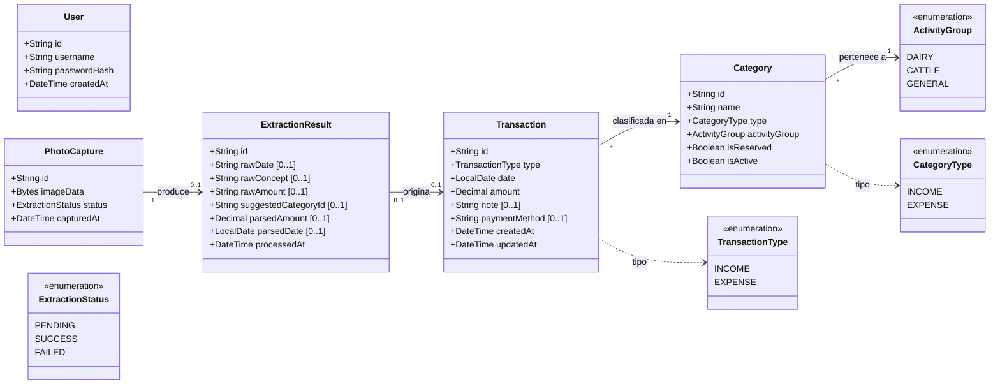

# Diagrama de Clases (Dominio)
### Sistema de Gestión Económica — Finca Ganadera
*Versión 2 · 10 de julio de 2026 — correcciones UML: atributo `activityGroup` en `Category`, multiplicidad `PhotoCapture 1 → 0..1 ExtractionResult`, notación de opcionalidad `[0..1]`*

---

> **Alcance:** Este es un diagrama de clases de **análisis** (modelo de dominio), no de diseño. Representa las entidades del negocio y sus relaciones. Las clases técnicas (repositorios, servicios, controladores) se definirán en el Paso 5 (Arquitectura).

## Diagrama

## Descripción de las clases

### Transaction
Entidad central del sistema. Representa un movimiento de dinero (ingreso o egreso) de la finca.

| Atributo | Tipo | Obligatorio | Descripción |
|---|---|---|---|
| id | String (UUID) | Sí | Identificador único |
| type | TransactionType | Sí | INCOME o EXPENSE |
| date | LocalDate | Sí | Fecha del movimiento (predeterminada: hoy) |
| amount | Decimal | Sí | Monto en COP (siempre positivo) |
| note | String | No | Nota descriptiva libre |
| paymentMethod | String | No | Medio de pago (efectivo, transferencia, etc.) |
| createdAt | DateTime | Sí | Fecha/hora de creación del registro |
| updatedAt | DateTime | Sí | Fecha/hora de última modificación |

**Trazabilidad:** RF-01, RF-02, RF-06

### Category
Clasificación fija de las transacciones, agrupada por actividad económica. Las categorías no se crean ni se eliminan por el usuario; vienen preconfiguradas. Las reservadas pueden activarse o desactivarse.

| Atributo | Tipo | Obligatorio | Descripción |
|---|---|---|---|
| id | String (UUID) | Sí | Identificador único |
| name | String | Sí | Nombre de la categoría (ej. "Venta de leche") |
| type | CategoryType | Sí | INCOME o EXPENSE |
| activityGroup | ActivityGroup | Sí | Actividad económica a la que pertenece (DAIRY, CATTLE, GENERAL) |
| isReserved | Boolean | Sí | `true` si es una categoría reservada |
| isActive | Boolean | Sí | `true` si está disponible para registro. Las no reservadas siempre son `true` |

**Trazabilidad:** RF-04, sección 8 del documento de requisitos

### ActivityGroup (enumeración)
Agrupa las categorías por línea de negocio.

| Valor | Descripción | Ejemplos de categorías |
|---|---|---|
| DAIRY | Lechería | Venta de leche, Venta de cuajada |
| CATTLE | Ganado | Venta de terneros, novillas, vacas, toros |
| GENERAL | Sin actividad específica | Egresos generales (salarios, servicios, impuestos, etc.) |

### User
Único usuario del sistema (decisión D4). Maneja la autenticación local.

| Atributo | Tipo | Obligatorio | Descripción |
|---|---|---|---|
| id | String (UUID) | Sí | Identificador único |
| username | String | Sí | Nombre de usuario |
| passwordHash | String | Sí | Contraseña almacenada como hash (RNF-04) |
| createdAt | DateTime | Sí | Fecha/hora de creación |

**Trazabilidad:** RF-07

### PhotoCapture (Could)
Representa una foto tomada de una anotación manuscrita. Solo existe si se implementa el épico de captura por IA (RF-09/10/11).

| Atributo | Tipo | Obligatorio | Descripción |
|---|---|---|---|
| id | String (UUID) | Sí | Identificador único |
| imageData | Bytes | Sí | Imagen capturada |
| status | ExtractionStatus | Sí | Estado del procesamiento |
| capturedAt | DateTime | Sí | Fecha/hora de captura |

**Trazabilidad:** RF-09

### ExtractionResult (Could)
Resultado de la extracción de datos por IA a partir de una foto. Solo existe si se implementa el épico de captura por IA.

| Atributo | Tipo | Obligatorio | Descripción |
|---|---|---|---|
| id | String (UUID) | Sí | Identificador único |
| rawDate | String | No | Fecha tal como fue extraída (texto crudo) |
| rawConcept | String | No | Concepto tal como fue extraído |
| rawAmount | String | No | Monto tal como fue extraído |
| suggestedCategoryId | String | No | Categoría sugerida por el sistema |
| parsedAmount | Decimal | No | Monto parseado a número |
| parsedDate | LocalDate | No | Fecha parseada |
| processedAt | DateTime | Sí | Fecha/hora de procesamiento |

**Trazabilidad:** RF-10, RF-11

## Decisiones de modelado

1. **Transaction no es abstracta:** se usa un solo tipo `Transaction` con un discriminador `type` (INCOME/EXPENSE) en lugar de dos subclases. Ambos comparten exactamente los mismos atributos; la distinción es solo semántica.

2. **Category es fija, no creada por el usuario:** las categorías se precargan con los datos de la sección 8 del documento de requisitos. El usuario solo puede activar/desactivar las reservadas.

3. **PhotoCapture y ExtractionResult son opcionales:** solo se implementan si el proyecto llega al épico de IA (Could). No son necesarias para el MVP.

4. **paymentMethod como String:** no se definieron medios de pago específicos en los requisitos. Se deja como texto libre por ahora; si el cliente necesita opciones fijas, se puede restringir en el Paso 5 o 6.
