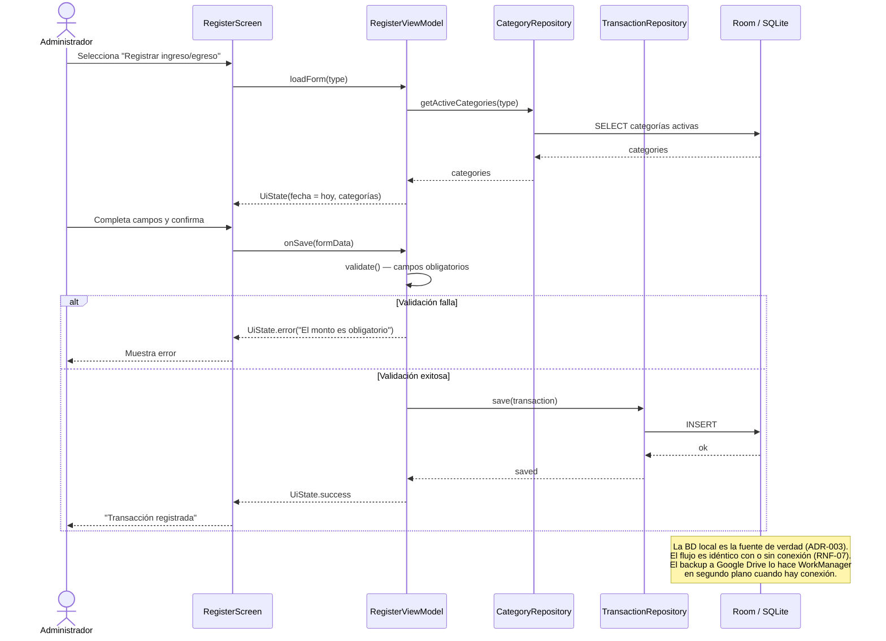
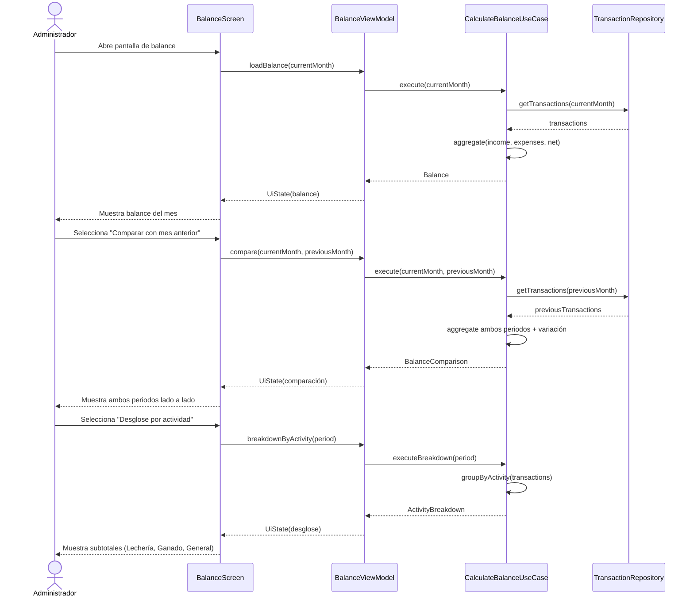
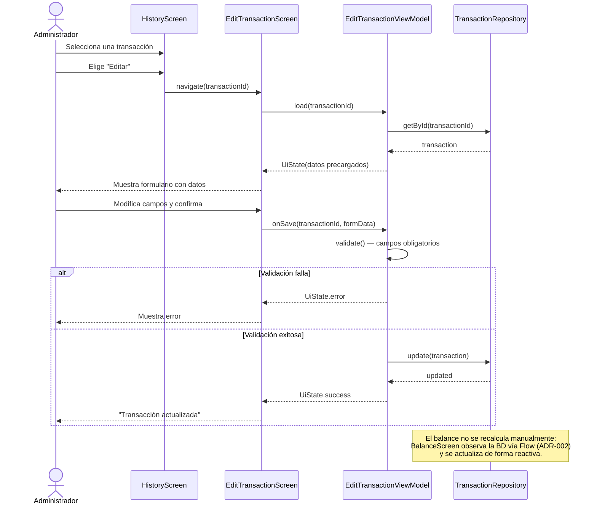
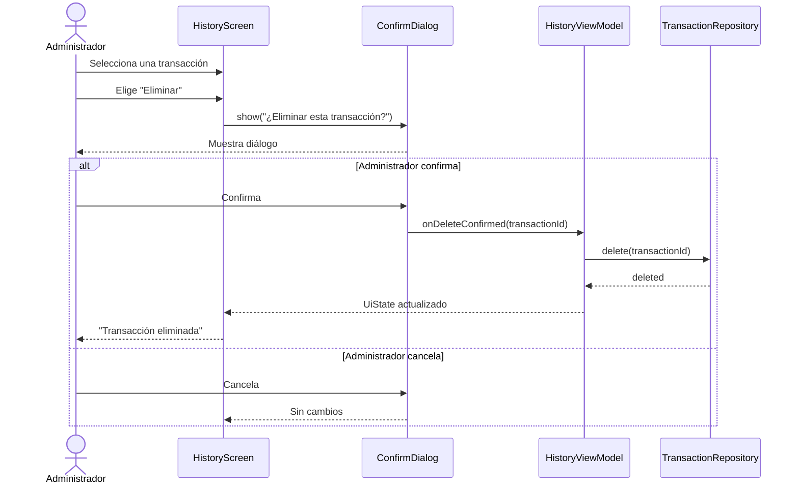
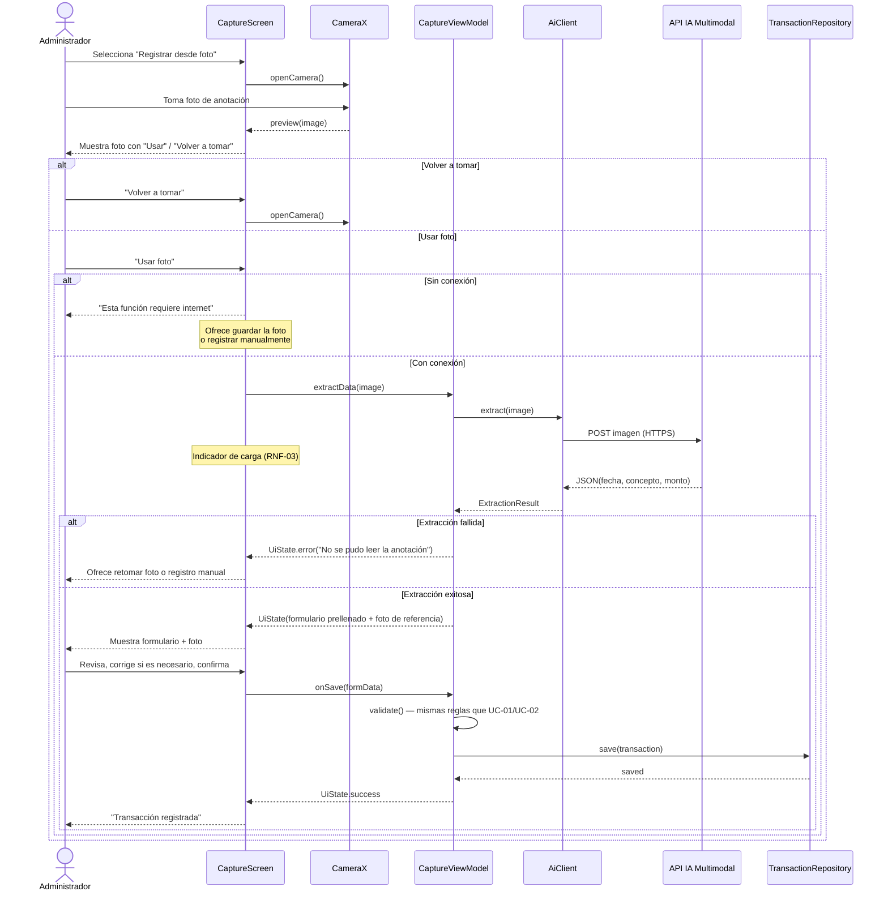
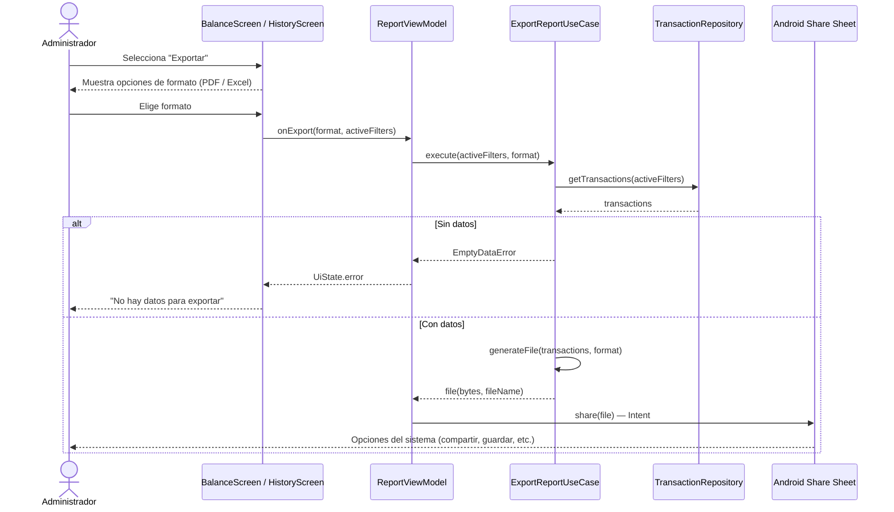

# Diagramas de Secuencia
### Sistema de Gestión Económica — Finca Ganadera
*Versión 2 · 10 de julio de 2026*

---

> **Nota:** Versión alineada con la arquitectura definida en el Paso 5 (`docs/4-arquitectura/`): MVVM + Clean Architecture ligera (estilo_arquitectonico.md) y stack Kotlin/Compose/Room (ADR-001, ADR-002). Los participantes son los componentes reales de cada capa. Según la convención de indirección: los flujos CRUD van `ViewModel → Repository` directo; la lógica no trivial (balance, exportación) pasa por un Use Case. Los nombres de métodos están en inglés (convención de código); las descripciones, en español.
>
> **Cambios de la v2:** se eliminó la "Cola de Sincronización" de SD-01 — contradecía ADR-003, que define un modelo **local-only**: la BD local es la fuente de verdad y no hay sincronización por transacción, solo backup periódico de la BD completa a Google Drive.

## SD-01 — Registrar transacción (ingreso o egreso)

Cubre UC-01 y UC-02 (HU-01, HU-02).

---

## SD-02 — Consultar balance general con comparación de periodos

Cubre UC-03 (HU-03). El cálculo del balance es lógica no trivial → pasa por `CalculateBalanceUseCase` (convención del estilo arquitectónico).

---

## SD-03 — Editar una transacción

Cubre UC-06 vía UC-05 (HU-06, HU-05). CRUD simple → `ViewModel → Repository` sin Use Case.

---

## SD-04 — Eliminar una transacción

Cubre UC-06 vía UC-05 (HU-06). CRUD simple → `ViewModel → Repository` sin Use Case.

---

## SD-05 — Captura por foto → extracción IA → corrección → registro

Cubre UC-09 → UC-10 → UC-11 (HU-09, HU-10, HU-11). Solo aplica si se implementa el épico de IA (Could). La cámara se maneja con CameraX (ADR-001); la llamada a la API multimodal, con el componente AI Client del C4 nivel 3.

---

## SD-06 — Exportar reporte

Cubre UC-08 (HU-08). La generación del archivo es lógica no trivial → pasa por `ExportReportUseCase`.

---

## Resumen de cobertura

| Diagrama | Casos de uso | Historias de usuario | Prioridad |
|---|---|---|---|
| SD-01 | UC-01, UC-02 | HU-01, HU-02 | Must |
| SD-02 | UC-03 | HU-03 | Must |
| SD-03 | UC-05, UC-06 | HU-05, HU-06 | Must |
| SD-04 | UC-05, UC-06 | HU-05, HU-06 | Must |
| SD-05 | UC-09, UC-10, UC-11 | HU-09, HU-10, HU-11 | Could |
| SD-06 | UC-08 | HU-08 | Should |

**Nota:** UC-04 (Gestionar categorías) y UC-07 (Autenticarse) no tienen diagrama de secuencia dedicado porque sus flujos son lineales y quedan suficientemente cubiertos en las especificaciones de casos de uso. UC-12 (Reportes visuales) es análogo a SD-02 (consulta de datos + renderizado).

## Mapeo participantes → arquitectura (Paso 5)

| Participante | Capa | Referencia |
|---|---|---|
| `*Screen`, `ConfirmDialog` | UI (Compose) | estilo_arquitectonico.md — Capa UI |
| `*ViewModel` | UI (estado vía StateFlow) | estilo_arquitectonico.md — Capa UI |
| `CalculateBalanceUseCase`, `ExportReportUseCase` | Domain | Convención: lógica no trivial → Use Case |
| `TransactionRepository`, `CategoryRepository` | Data | estilo_arquitectonico.md — Capa Data |
| `Room / SQLite` | Data | ADR-002 |
| `AiClient` | Data | C4 nivel 3 — componente AI Client (Could) |
| `CameraX`, `Android Share Sheet` | Plataforma Android | ADR-001 |
