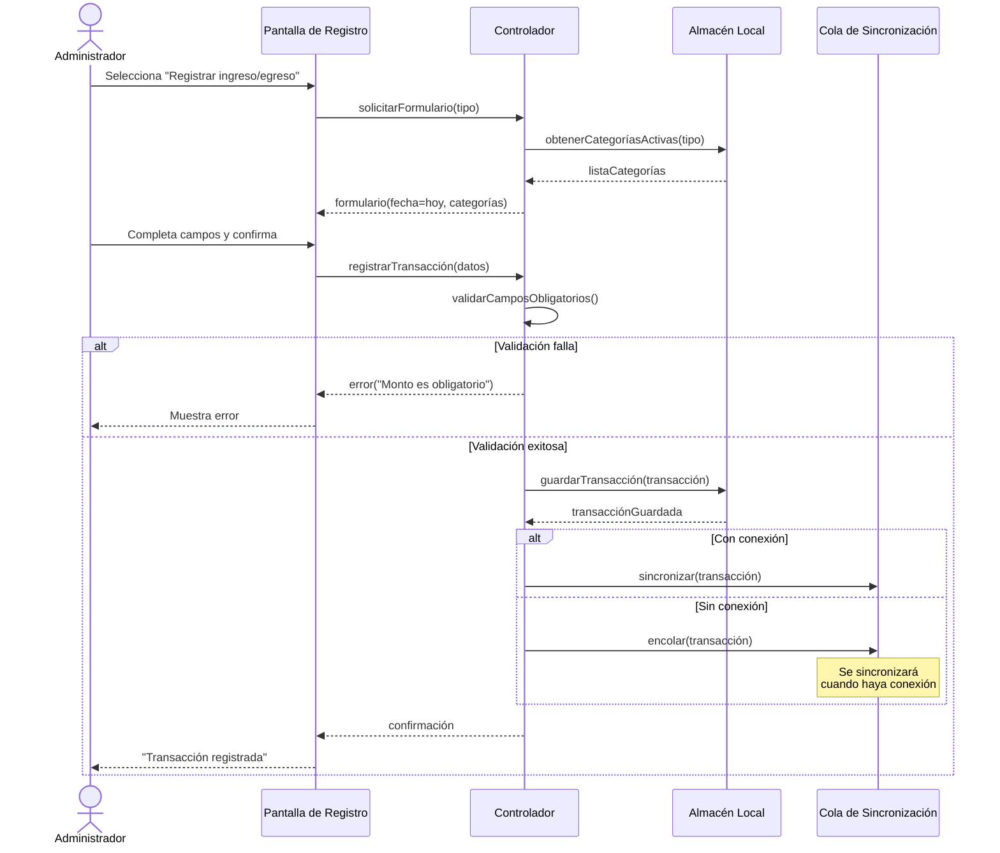
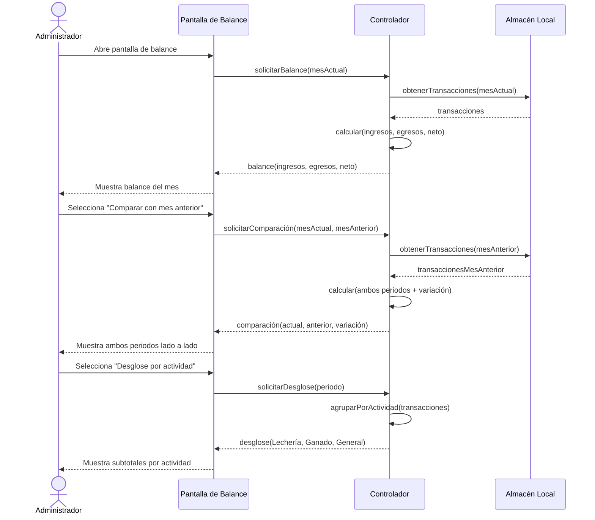
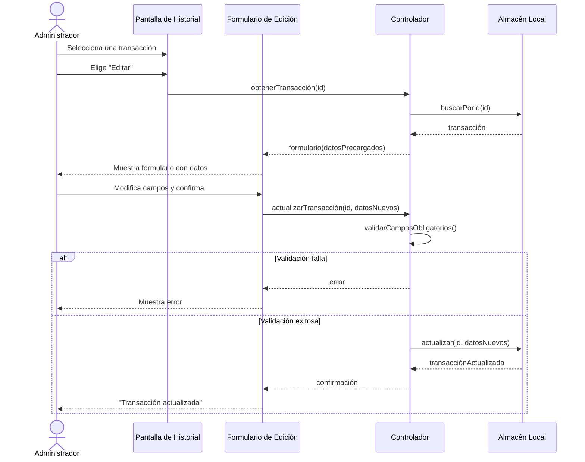
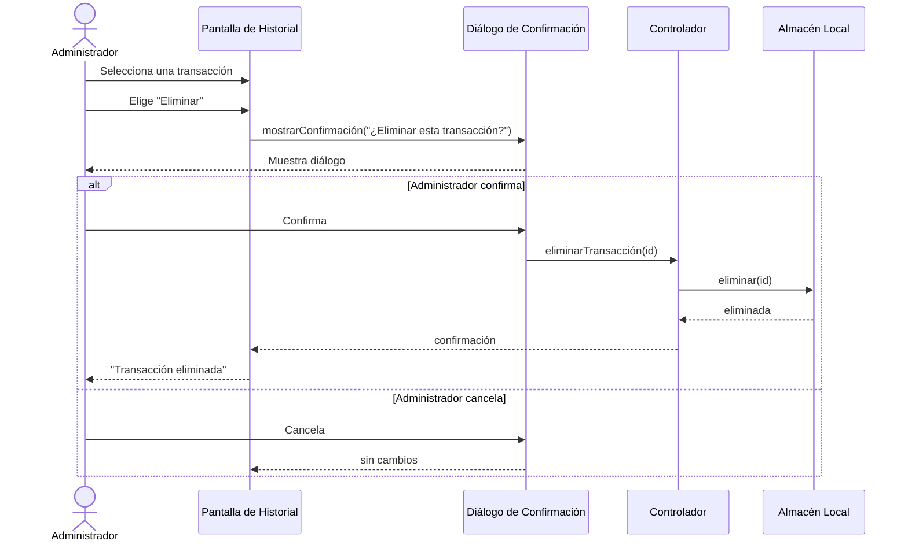
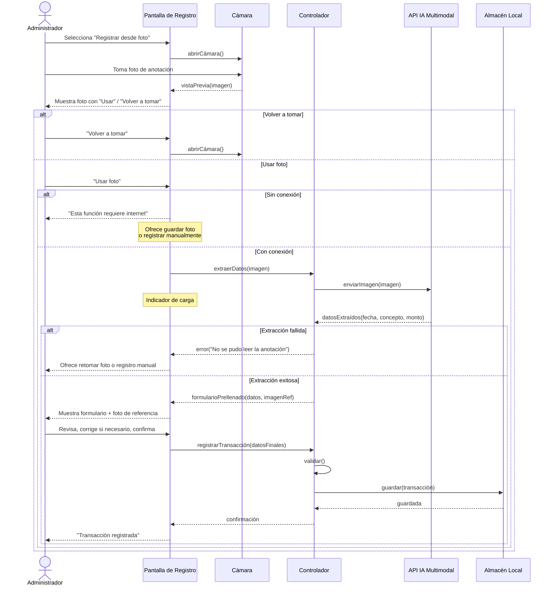
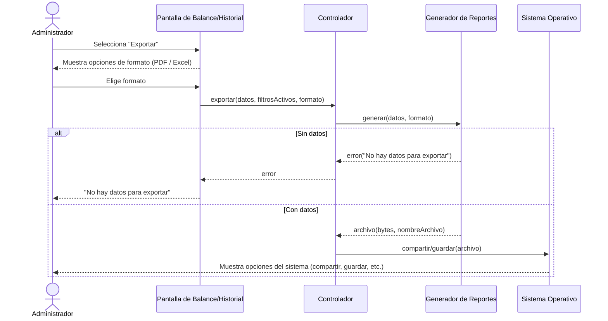

# Diagramas de Secuencia
### Sistema de Gestión Económica — Finca Ganadera
*Versión 1 · 9 de julio de 2026*

---

> **Nota:** Estos diagramas representan los flujos principales del sistema a nivel de análisis. Los nombres de componentes (UI, Controller, Repository, etc.) son genéricos — la tecnología concreta se define en el Paso 5. El objetivo es mostrar la interacción entre el actor y el sistema, no la arquitectura interna.

## SD-01 — Registrar transacción (ingreso o egreso)

Cubre UC-01 y UC-02 (HU-01, HU-02).

---

## SD-02 — Consultar balance general con comparación de periodos

Cubre UC-03 (HU-03).

---

## SD-03 — Editar una transacción

Cubre UC-06 vía UC-05 (HU-06, HU-05).

---

## SD-04 — Eliminar una transacción

Cubre UC-06 vía UC-05 (HU-06).

---

## SD-05 — Captura por foto → extracción IA → corrección → registro

Cubre UC-09 → UC-10 → UC-11 (HU-09, HU-10, HU-11). Solo aplica si se implementa el épico de IA (Could).

---

## SD-06 — Exportar reporte

Cubre UC-08 (HU-08).

---

## Resumen de cobertura

| Diagrama | Casos de uso | Historias de usuario | Prioridad |
|---|---|---|---|
| SD-01 | UC-01, UC-02 | HU-01, HU-02 | Must |
| SD-02 | UC-03 | HU-03 | Must |
| SD-03 | UC-05, UC-06 | HU-05, HU-06 | Must |
| SD-04 | UC-05, UC-06 | HU-05, HU-06 | Must |
| SD-05 | UC-09, UC-10, UC-11 | HU-09, HU-10, HU-11 | Could |
| SD-06 | UC-08 | HU-08 | Should |

**Nota:** UC-04 (Gestionar categorías) y UC-07 (Autenticarse) no tienen diagrama de secuencia dedicado porque sus flujos son lineales y quedan suficientemente cubiertos en las especificaciones de casos de uso. UC-12 (Reportes visuales) es análogo a SD-02 (consulta de datos + renderizado).
