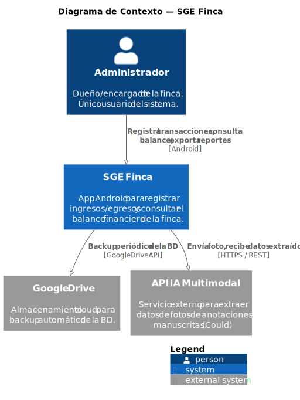
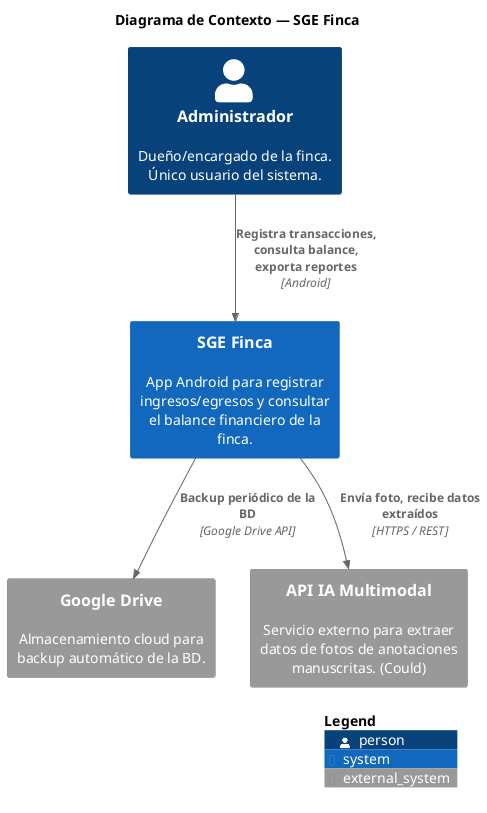
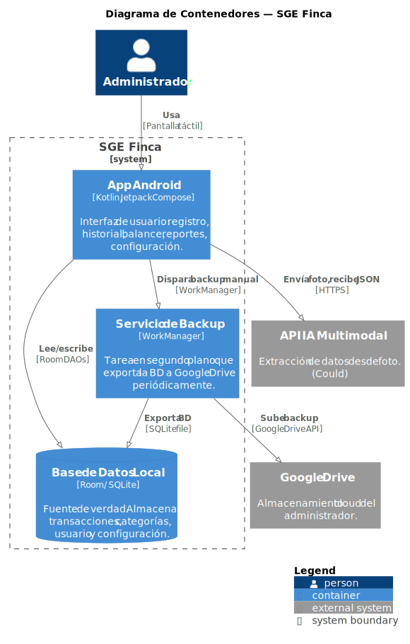
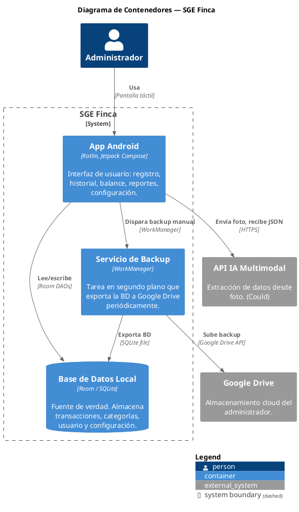
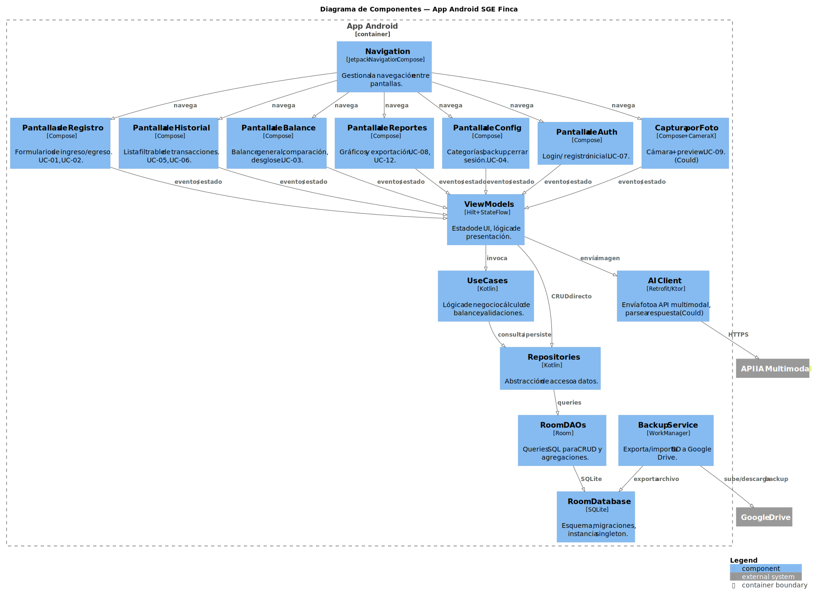
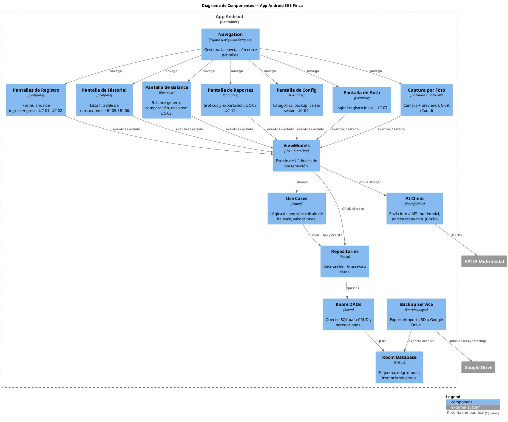

# Diagramas C4
### Sistema de Gestión Económica — Finca Ganadera
*Versión 2 · 10 de julio de 2026 — migrados de la sintaxis experimental C4 de Mermaid a **C4-PlantUML**; los SVG se generan con `scripts/render-diagrams.sh` y se commitean en `assets/`*

---

## Nivel 1 — Contexto del Sistema

Muestra el sistema como caja negra, su actor principal y los sistemas externos con los que interactúa.

Fuente PlantUML

### Notas
- La API IA Multimodal es opcional (prioridad Could). Solo se invoca si se implementa el épico de captura por foto (RF-09/10/11). El proveedor concreto se decidirá en la fase de implementación.
- Google Drive se usa exclusivamente para backup, no para sincronización multi-dispositivo (decisión ADR-003).

---

## Nivel 2 — Contenedores

Muestra las unidades desplegables del sistema y cómo se comunican.

Fuente PlantUML

### Notas
- Solo hay un contenedor desplegable: la **app Android** (APK). Room y WorkManager son componentes internos de la app, no servicios separados.
- No hay backend propio ni servidor remoto (ADR-003).

---

## Nivel 3 — Componentes

Muestra los módulos internos de la app Android y sus responsabilidades.

Fuente PlantUML

### Mapeo componentes → requisitos

| Componente | Casos de Uso | Requisitos |
|---|---|---|
| Pantallas de Registro + VM | UC-01, UC-02 | RF-01, RF-02, RNF-01 |
| Pantalla de Balance + VM | UC-03 | RF-03, RNF-02 |
| Pantalla de Historial + VM | UC-05, UC-06 | RF-05, RF-06 |
| Pantalla de Config | UC-04 | RF-04 |
| Pantalla de Auth | UC-07 | RF-07, RNF-04 |
| Pantalla de Reportes + VM | UC-08, UC-12 | RF-08, RF-12 |
| Captura por Foto + AI Client | UC-09, UC-10, UC-11 | RF-09, RF-10, RF-11, RNF-03 |
| Room Database + DAOs | — (transversal) | RNF-06, RNF-07 |
| Backup Service | — (transversal) | RNF-04 |
| Repositories + Use Cases | — (transversal) | Testabilidad, mantenibilidad |

---

> **Regenerar los SVG:** tras editar cualquier bloque PlantUML de este documento, ejecuta `scripts/render-diagrams.sh` y commitea los cambios de `assets/`. El CI falla si el SVG commiteado no corresponde a la fuente.
