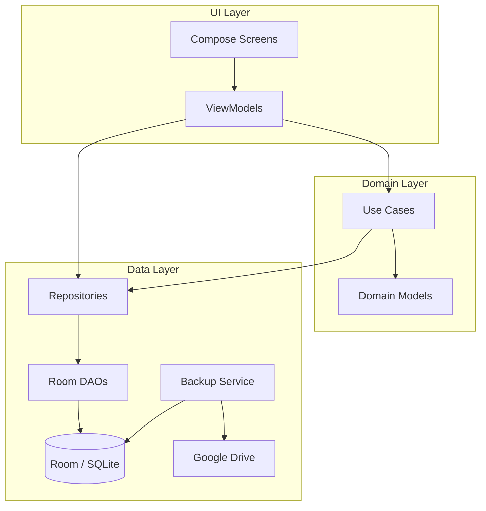

# Estilo Arquitectónico
### Sistema de Gestión Económica — Finca Ganadera
*Versión 1 · 9 de julio de 2026*

---

## Decisión

**MVVM (Model-View-ViewModel)** con separación en capas inspirada en Clean Architecture, adaptada a la escala del proyecto (app pequeña, un solo usuario, un solo desarrollador).

## Justificación

### ¿Por qué MVVM?

MVVM es el patrón recomendado oficialmente por Google para aplicaciones Android con Jetpack Compose. La razón es simple: Compose es declarativo y reactivo — los `@Composable` se re-renderizan cuando cambia el estado, y el ViewModel es el lugar natural para exponer ese estado de forma observable (vía `StateFlow`).

| Alternativa | Por qué no |
|---|---|
| MVC | No tiene separación clara en Android; el Activity/Fragment termina siendo Controller + View. Con Compose no aplica. |
| MVP | Requiere interfaces View/Presenter que añaden boilerplate sin aportar valor sobre MVVM + Compose. |
| MVI (Model-View-Intent) | Más riguroso que MVVM (estado único, reducers), pero sobredimensionado para una app con flujos simples de CRUD y consulta. |

### ¿Por qué "Clean Architecture ligera"?

Clean Architecture clásica (Robert C. Martin) propone 3-4 capas con inversión de dependencias estricta. Para un proyecto con 6 entidades, 12 casos de uso CRUD/consulta y un solo desarrollador, la versión completa introduce demasiada indirección (interfaces para todo, mappers entre capas, etc.).

Se adopta una versión **ligera** con 3 capas y reglas claras de dependencia, sin la capa de mappers intermedios ni abstracciones prematuras:

## Capas

```
┌─────────────────────────────────────────┐
│            UI (Presentation)            │
│  Compose Screens + ViewModels           │
│  Expone StateFlow, recibe eventos       │
├─────────────────────────────────────────┤
│            Domain (Lógica)              │
│  Use Cases (opcional) + Modelos         │
│  Reglas de negocio puras                │
├─────────────────────────────────────────┤
│            Data (Persistencia)          │
│  Room DAOs + Repositories              │
│  Google Drive backup service            │
└─────────────────────────────────────────┘

Regla: UI → Domain → Data (nunca al revés)
```

### Capa UI (Presentation)
- **Compose Screens:** pantallas declarativas (`@Composable`). No contienen lógica de negocio.
- **ViewModels:** exponen el estado de la UI como `StateFlow<UiState>`. Reciben eventos del usuario, invocan la capa de dominio y actualizan el estado.
- **Navegación:** Jetpack Navigation Compose.

### Capa Domain (Lógica de negocio)
- **Modelos de dominio:** `Transaction`, `Category`, `User`, etc. Son clases Kotlin simples (data classes), sin anotaciones de Room.
- **Use Cases (opcionales):** solo se crean cuando la lógica es lo suficientemente compleja para justificar una clase propia. Ejemplo: `CalculateBalanceUseCase` (agrega por periodo y actividad). Para operaciones CRUD simples, el ViewModel puede invocar directamente al Repository.
- **Sin dependencia de Android:** esta capa es Kotlin puro, testeable sin emulador.

### Capa Data (Persistencia)
- **Room Entities:** clases anotadas con `@Entity` que mapean a tablas SQLite.
- **DAOs:** interfaces con `@Dao` que definen las queries SQL.
- **Repositories:** clases que abstraen el acceso a datos. El ViewModel depende del Repository, no del DAO directamente. Esto permite cambiar la fuente de datos sin tocar la UI.
- **Backup Service:** componente que maneja la exportación/importación de la BD a Google Drive.

## Convención sobre indirección

Para mantener la simplicidad (este es un proyecto pequeño, no una plataforma empresarial):

| Situación | Enfoque |
|---|---|
| CRUD simple (crear, leer, actualizar, eliminar transacción) | ViewModel → Repository → DAO. Sin UseCase intermedio. |
| Lógica de negocio no trivial (calcular balance con desglose, validar reglas de categorías) | ViewModel → UseCase → Repository. |
| Mapeo entre Room Entity y modelo de dominio | Solo si los modelos divergen. Mientras sean iguales, se usa la misma clase (con anotaciones Room). Si divergen, se introduce un mapper puntual. |

## Diagrama de dependencias



## Inyección de dependencias

Se usará **Hilt** (Dagger simplificado para Android) para inyección de dependencias. Esto permite:
- Inyectar Repositories en ViewModels sin acoplamiento directo.
- Proveer la instancia de Room Database como singleton.
- Facilitar el testing con fakes/mocks.

Hilt es la solución recomendada por Google y tiene integración directa con ViewModel y Navigation Compose.

## Trazabilidad

| Componente | Requisitos que satisface |
|---|---|
| MVVM + Compose | RNF-01 (UI simple), RNF-05 (Android nativo) |
| Room + Repository | RNF-06 (sin pérdida de datos), RNF-07 (offline-first) |
| Backup Service + Google Drive | RNF-04 (respaldo periódico) |
| Capa Domain pura Kotlin | Testabilidad, mantenibilidad |
| Hilt DI | Desacoplamiento, testabilidad |
